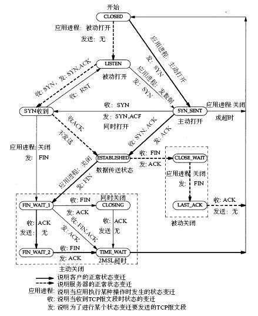
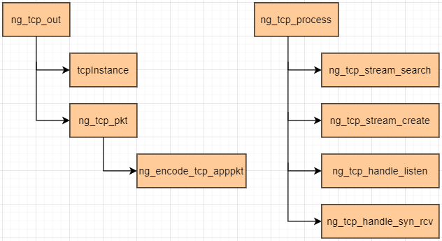

# DPDK1911 课程记录

[toc]

## 第2节 dpdk网络协议栈之udp/tcp的实现

> 本记录主要针对于，第2节最后三门课：
>
> tcp三次握手实现之dpdk-tcp流程框架设计；
>
> tcp三次握手实现之dpdk-tcp11种状态实现；
>
> tcp三次握手实现之dpdk-代码调试

### 1 TCP头部格式


> 1. 16位源端口号：发送方的端口号。
>
> 2. 16位目的端口号：发送方的目标端口号。
>
> 3. 32位序列号：seq number，保证网络传输数据的顺序性。
>
> 4. 32位确认号：ack number，用来确认确实有收到相关封包，内容表示期望收到下一个报文的序列号，用来解决丢包的问题。
>
> 5. 4位头部大小：最大值为0x0F即15，单位为32位(bit)也就是4个字节(byte)，给出头部占32bit的数目。没有任何选项字段的TCP头部长度为20字节；最多可以有60(15*4)字节的TCP头部。
>
> 6. 4位保留位：Reserved  4bit，预留字段，都为0。
>
> 7. 8位TCP标志位：
>
>    ```
>    （1）CWR：Congestion window reduced，拥塞窗口减少。拥塞窗口减少标志被发送主机设置，用来表明它接收到了设置ECE标志的TCP包。拥塞窗口是被TCP维护的一个内部变量，用来管理发送窗口大小。
>    （2）ECN-Echo：显式拥塞提醒回应。当一个IP包的ECN域被路由器设置为11时，接收端而非发送端被通知路径上发生了拥塞。ECN使用TCP头部来告知发送端网络正在经历拥塞，并且告知接收端发送段已经受到了接收端发来的拥塞通告，已经降低了发送速率。
>    （3）URG：为1时，紧急指针（urgent pointer）有效，配合紧急指针使用。
>    （4）ACK：为1时，确认号有效。
>    （5）PSH：为1时，接收方应该尽快将这个报文段交给应用层。
>    （6）RST：为1时，释放连接，重连。
>    （7）SYN：为1时，发起一个连接。
>    （8）FIN：为1时，关闭一个连接。
>    ```
>
> 8.  16位窗口大小：此字段用来进行流量控制，主要用于解决流控拥塞的问题。单位为字节数，这个值是本机期望一次接收的字节数。
>
> 9.  16位校验值：对整个TCP报文段，即TCP头部和TCP数据进行校验和计算，并由目标端进行验证。
>
> 10.  16位紧急指针：是一个偏移量，和序号字段中的值相加表示紧急数据最后一个字节的序号。
>
> 11.  32位Tcp选项:一般包含在三次握手中。最长可以占到40个字节(byte)
>

### 2 TCP协议相关新增代码结构

搜索`#define ENABLE_TCP_APP 1`这个宏，定义这个宏的作用更多是便于搜索查看新增的关于TCP协议的源码，梳理一下TCP握手的整体结构，从功能角度看，**分下面6个流程：**

* 建立TCP连接：服务端的流程`LISTEN,SYN_RCVD`
* 数据传输：服务端接受数据的流程`ESTABLISHED`
* 断开TCP连接：服务端被动断开TCP连接的流程 `CLOSE_WAIT,LAST_ACK`
* 建立TCP连接：客户端流程 `CLOSED,SYN_SENT`
* 数据传输：主动发送 `ESTABLISHED`
* 断开TCP连接：主动断开`FIN_WAIT_1,FIN_WAIT_2,CLOSING,TIME_WAIT`

附一张tcp协议状态机跃迁图



#### 2.1 TCP代码，**新增4个数据结构：**

* `typedef enum _NG_TCP_STATUS{...}NG_TCP_STATUS;`:TCP状态机的11个状态；

 > * `struct ng_tcp_stream{...};`：对应一个TCP连接；内核维护
 > * `struct ng_tcp_table{...};`：一个关于`stream`的双向联表；

* `struct ng_tcp_fragment{...};`:对应一个TCP数据包，比如在pkt_process中取出`struct rte_mbuf`包，然后要甩给`tcp posix api`里面的`rcv_buff`中去，就会用到这个结构体；

#### 2.2 TCP代码，**新增9个函数：**

* 组织架构图如下：


* 新增的函数其中最重要的两个函数`ng_tcp_process`与`ng_tcp_out`，其中`ng_tcp_process`尤为重要，因为其实现了TCP连接的状态机。调用关系如下：

  

#### 2.3 函数`ng_tcp_process`

这里有个坑需要注意，一般先拿到tcp头里面的`tcpcksum`值，然后置`0`，然后再计算`cksum`，接着比较两者是否相等，该机制在`ng_tcp_process`函数里

```c
static int ng_tcp_process(struct rte_mbuf *tcpmbuf) {
    struct rte_ipv4_hdr *iphdr = NULL;
    struct rte_tcp_hdr *tcphdr = NULL;
    struct ng_tcp_stream *stream = NULL;

    iphdr = (struct rte_ipv4_hdr *)rte_pktmbuf_mtod_offset(tcpmbuf, struct rte_ipv4_hdr *, sizeof(struct rte_ether_hdr));
    tcphdr = (struct rte_tcp_hdr *)(iphdr + 1);
    //处理包之前，先校验一波cksum,UDP也是这样，如果校验失败了，是内核抛弃还是APP抛弃？
    uint16_t tcpcksum = tcphdr->cksum;
    tcphdr->cksum = 0;
    uint16_t cksum = rte_ipv4_udptcp_cksum(iphdr, tcphdr);
    if(cksum != tcpcksum){
        printf("cksum %x, tcp cksum %x\n", cksum, tcpcksum);
        return -1;
    }
    stream = ng_tcp_stream_search(iphdr->src_addr, iphdr->dst_addr, 
        tcphdr->src_port, tcphdr->dst_port);
    if(stream == NULL) {
        stream = ng_tcp_stream_create(iphdr->src_addr, iphdr->dst_addr,
            tcphdr->src_port, tcphdr->dst_port);
    }
    /****实现TCP连接的状态机，一个状态加一个回调函数，过滤器模式，责任链模式****/
    switch (stream->status) {
        case NG_TCP_STATUS_CLOSED:          // 这种只存在于client
            break;
        case NG_TCP_STATUS_LISTEN:          // 这种只存在于server
            ng_tcp_handle_listen(stream, tcphdr);
            break;
        case NG_TCP_STATUS_SYN_RCVD:        // server
            ng_tcp_handle_syn_rev(stream, tcphdr);
            break;
        case NG_TCP_STATUS_SYN_SENT:        // client
            break;
        case NG_TCP_STATUS_ESTABLISHED: {    // server | client
            //计算TCP包的总长度=ip包总长度-ip头长度
            int tcplen = ntohs(iphdr->total_length) - sizeof(struct rte_ipv4_hdr);
            ng_tcp_handle_established(stream, tcphdr, tcplen);
            break;
        }
        case NG_TCP_STATUS_FIN_WAIT_1:      
            // 暂定client,谁先主动断开，server | client,本代码中是由net assistant主动关闭的，所以暂定client
            break;
        case NG_TCP_STATUS_FIN_WAIT_2:      // 暂定client
            break;
        case NG_TCP_STATUS_CLOSING:         // 暂定client
            break;
        case NG_TCP_STATUS_TIME_WAIT:       // 暂定client
            break;
        case NG_TCP_STATUS_CLOSE_WAIT:      // 暂定server
            break;
        case NG_TCP_STATUS_LAST_ACK:        // 暂定server
            break;
    }
    return 0;
}
```

#### 2.4 函数`ng_tcp_handle_listen`

server端处于`LISTEN`状态，当收到`SYN`包时，使用`ng_tcp_handle_listen`函数来处理，里面最重要的一

> `fragment->seqnum = stream->send_nxt;`
>
> `fragment->acknum = ntohl(tcphdr->sent_seq) + 1; `
>
> `stream->recv_nxt = fragment->acknum;`

```c
static int ng_tcp_handle_listen(struct ng_tcp_stream *stream, struct rte_tcp_hdr *tcphdr) {

    if (tcphdr->tcp_flags & RTE_TCP_SYN_FLAG) {
        if(stream->status == NG_TCP_STATUS_LISTEN) {
            struct ng_tcp_fragment *fragment = rte_malloc("ng_tcp_fragment", sizeof(struct ng_tcp_fragment), 0);
            if(fragment == NULL) return -1;
            memset(fragment, 0, sizeof(struct ng_tcp_fragment));
            fragment->sport = tcphdr->dst_port;
            fragment->dport = tcphdr->src_port;
            fragment->seqnum = stream->send_nxt;
            fragment->acknum = ntohl(tcphdr->sent_seq) + 1; //先ntoh再加一，因为最小端加一与最大端加一是不一样的。
            stream->recv_nxt = fragment->acknum;
            fragment->tcp_flags = (RTE_TCP_SYN_FLAG | RTE_TCP_ACK_FLAG);
            fragment->windows = TCP_INITIAL_WINDOW;
            fragment->opt_len = 0;
            fragment->hdrlen_off = 0x50;//0x05; 要写成0x50
            fragment->data = NULL;
            fragment->length = 0;
            rte_ring_mp_enqueue(stream->sndbuf, fragment);
            stream->status = NG_TCP_STATUS_SYN_RCVD;//fragment搞完了，状态机进行状态跃迁
        }
    }
    return 0;
}
```

## 第3节 dpdk网络协议栈之tcp的实现

### 1 tcp数据传输之ack与seqnumde的确认实现

#### 1.1 函数`ng_tcp_handle_established`

当TCP连接处于`ESTABLISHED`时候，可能会接收到两种包`ACK`包，`PUSH`包；其中`PUSH`包可以理解成需要立即推给应用程序来处理的数据包，内核收到这种包，意思就是不用等后面的数据包了，直接给应用程序处理；如果没有`PUSH`可能会等后续包到来，组包之后再发给应用程序。


#### 1.2 `tcp posix api`的实现


#### 1.3 tcp的慢启动与滑动窗口


----

issue1：`struct localhost` 与 `struct tcp_stream`能不能合二为一

issue2：`ng_tcp_out`函数与`ng_udp_out`函数能不能合二为一

issue3: `static`函数没有提前声名，或者函数定义放在调用位置之前。

```bash
root/Documents/dpdk-stable-19.11.11/course-dpdk/course-code/08_tcp/tcp.c:480:17: error: implicit declaration of function ‘ng_tcp_process’ [-Werror=implicit-function-declaration]
                 ng_tcp_process(mbufs[i]);

```

issue4:函数没有提前声名。加上`static`之后放在调用位置之前；或者提前声名static函数，或者提前声名成全局函数，放在同名.h头文件里面。

```bash

/root/Documents/dpdk-stable-19.11.11/course-dpdk/course-code/08_tcp/tcp.c:1089:22: error: no previous prototype for ‘tcpInstance’ [-Werror=missing-prototypes]
 struct ng_tcp_table *tcpInstance(void) {

```

issu5: void ** obj__p，入参是一个不兼容的类型

```bash
/root/Documents/dpdk-stable-19.11.11/course-dpdk/course-code/08_tcp/tcp.c: In function ‘ng_tcp_out’:
/root/Documents/dpdk-stable-19.11.11/course-dpdk/course-code/08_tcp/tcp.c:1250:9: error: passing argument 2 of ‘rte_ring_mc_dequeue’ from incompatible pointer type [-Werror]
         int nb_snd = rte_ring_mc_dequeue(iter->sndbuf, &fragment);
         ^
In file included from /root/Documents/dpdk-stable-19.11.11/build/include/rte_mempool.h:50:0,
                 from /root/Documents/dpdk-stable-19.11.11/build/include/rte_mbuf.h:38,
                 from /root/Documents/dpdk-stable-19.11.11/build/include/rte_ether.h:23,
                 from /root/Documents/dpdk-stable-19.11.11/build/include/rte_ethdev.h:159,
                 from /root/Documents/dpdk-stable-19.11.11/course-dpdk/course-code/08_tcp/tcp.c:4:
/root/Documents/dpdk-stable-19.11.11/build/include/rte_ring.h:626:1: note: expected ‘void **’ but argument is of type ‘struct ng_tcp_fragment **’
 rte_ring_mc_dequeue(struct rte_ring *r, void **obj_p)

```

issue6:

```bash
/root/Documents/dpdk-stable-19.11.11/course-dpdk/course-code/08_tcp/tcp.c: In function ‘ng_tcp_out’:
/root/Documents/dpdk-stable-19.11.11/course-dpdk/course-code/08_tcp/tcp.c:1273:1: error: no return statement in function returning non-void [-Werror=return-type]
 }

/root/Documents/dpdk-stable-19.11.11/course-dpdk/course-code/08_tcp/tcp.c: In function ‘ng_tcp_process’:
/root/Documents/dpdk-stable-19.11.11/course-dpdk/course-code/08_tcp/tcp.c:1348:1: error: control reaches end of non-void function [-Werror=return-type]
 }

```

issue7:

原因是由于我在case之后进行变量的声明而导致的错误，对此问题的分析：
由于switch的几个case语句在同一个作用域（因为case 语句只是标签，它们共属于一个swtich语句块），所以如果在某个case下面声明变量的话，对象的作用域是在俩个花括号之间 也就是整个switch语句，其他的case语句也能看到，这样的话就可能导致错误。我们可以通过在case后面的语句加上大括号处理，之所以加大括号就是为了明确我们声明的变量的作用域，就是仅仅在本case之中，其实为了更规范的写switch-case语句，我们应该在case语句后边加大括号。

```c
 error: a label can only be part of a statement and a declaration is not a statement
             uint8_t hdrlen = tcphdr->data_off & 0xf0;

```


