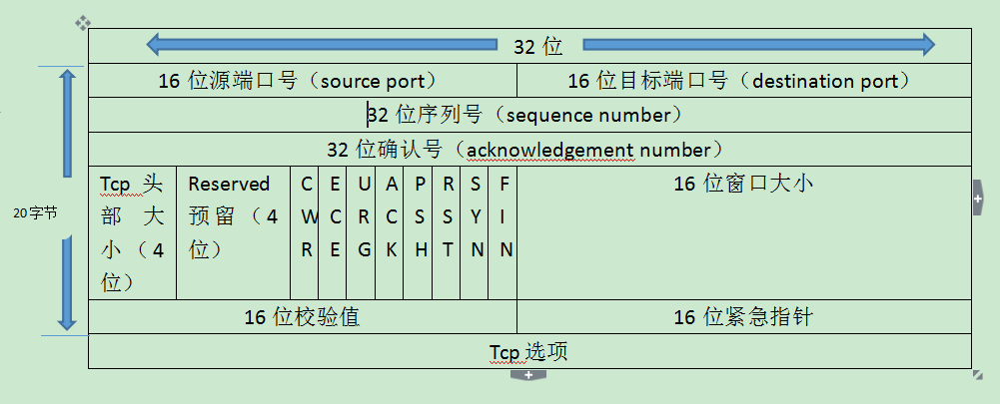
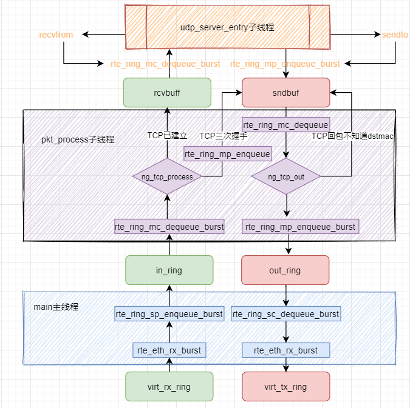
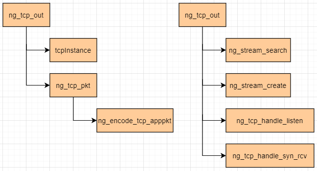

# DPDK1911 课程记录

[toc]

## tcp三次握手实现之dpdk1911

### 1 TCP头部格式



> 1. 16位源端口号：发送方的端口号。
>
> 2. 16位目的端口号：发送方的目标端口号。
>
> 3. 32位序列号：seq number，保证网络传输数据的顺序性。
>
> 4. 32位确认号：ack number，用来确认确实有收到相关封包，内容表示期望收到下一个报文的序列号，用来解决丢包的问题。
>
> 5. 4位头部大小：最大值为0x0F即15，单位为32位(bit)也就是4个字节(byte)，给出头部占32bit的数目。没有任何选项字段的TCP头部长度为20字节；最多可以有60(15*4)字节的TCP头部。
>
> 6. 4位保留位：Reserved  4bit，预留字段，都为0。
>
> 7. 8位TCP标志位：
>
>    ```
>    （1）CWR：Congestion window reduced，拥塞窗口减少。拥塞窗口减少标志被发送主机设置，用来表明它接收到了设置ECE标志的TCP包。拥塞窗口是被TCP维护的一个内部变量，用来管理发送窗口大小。
>    （2）ECN-Echo：显式拥塞提醒回应。当一个IP包的ECN域被路由器设置为11时，接收端而非发送端被通知路径上发生了拥塞。ECN使用TCP头部来告知发送端网络正在经历拥塞，并且告知接收端发送段已经受到了接收端发来的拥塞通告，已经降低了发送速率。
>    （3）URG：为1时，紧急指针（urgent pointer）有效，配合紧急指针使用。
>    （4）ACK：为1时，确认号有效。
>    （5）PSH：为1时，接收方应该尽快将这个报文段交给应用层。
>    （6）RST：为1时，释放连接，重连。
>    （7）SYN：为1时，发起一个连接。
>    （8）FIN：为1时，关闭一个连接。
>    ```
>
> 8.  16位窗口大小：此字段用来进行流量控制，主要用于解决流控拥塞的问题。单位为字节数，这个值是本机期望一次接收的字节数。
>
> 9.  16位校验值：对整个TCP报文段，即TCP头部和TCP数据进行校验和计算，并由目标端进行验证。
>
> 10.  16位紧急指针：是一个偏移量，和序号字段中的值相加表示紧急数据最后一个字节的序号。
>
> 11.  32位Tcp选项:一般包含在三次握手中。最长可以占到40个字节(byte)
>

### 2 TCP协议相关新增代码结构

搜索`#define ENABLE_TCP_APP 1`这个宏，定义这个宏的作用更多是便于搜索查看新增的关于TCP协议的源码，梳理一下TCP握手的整体结构，从功能角度看，**分下面6个流程：**

* 建立TCP连接：服务端的流程`LISTEN,SYN_RCVD`

* 数据传输：服务端接受数据的流程`ESTABLISHED`

* 断开TCP连接：服务端被动断开TCP连接的流程 `CLOSE_WAIT,LAST_ACK`

* 建立TCP连接：客户端流程 `CLOSED,SYN_SENT`

* 数据传输：主动发送 `ESTABLISHED`

* 断开TCP连接：主动断开`FIN_WAIT_1,FIN_WAIT_2,CLOSING,TIME_WAIT`

#### 2.1 TCP代码，**新增4个数据结构：**

* `typedef enum _NG_TCP_STATUS{...}NG_TCP_STATUS;`:TCP状态机的11个状态；

 > * `struct ng_tcp_stream{...};`：对应一个TCP连接；内核维护
 > * `struct ng_tcp_table{...};`：一个关于`stream`的双向联表；

* `struct ng_tcp_fragment{...};`:对应一个TCP数据包；

#### 2.2 TCP代码，**新增9个函数：**

* 组织架构图如下：



* 新增的函数其中最重要的两个函数`ng_tcp_process`与`ng_tcp_out`，其中`ng_tcp_process`尤为重要，因为其实现了TCP连接的状态机。调用关系如下：

  

----

issue1：`struct localhost` 与 `struct tcp_stream`能不能合二为一

issue2：`ng_tcp_out`函数与`ng_udp_out`函数能不能合二为一

issue3: `static`函数没有提前声名，或者函数定义放在调用位置之前。

```bash
root/Documents/dpdk-stable-19.11.11/course-dpdk/course-code/08_tcp/tcp.c:480:17: error: implicit declaration of function ‘ng_tcp_process’ [-Werror=implicit-function-declaration]
                 ng_tcp_process(mbufs[i]);

```

issue4:函数没有提前声名。加上`static`之后放在调用位置之前；或者提前声名static函数，或者提前声名成全局函数，放在同名.h头文件里面。

```bash

/root/Documents/dpdk-stable-19.11.11/course-dpdk/course-code/08_tcp/tcp.c:1089:22: error: no previous prototype for ‘tcpInstance’ [-Werror=missing-prototypes]
 struct ng_tcp_table *tcpInstance(void) {

```

issu5: void ** obj__p，入参是一个不兼容的类型

```bash
/root/Documents/dpdk-stable-19.11.11/course-dpdk/course-code/08_tcp/tcp.c: In function ‘ng_tcp_out’:
/root/Documents/dpdk-stable-19.11.11/course-dpdk/course-code/08_tcp/tcp.c:1250:9: error: passing argument 2 of ‘rte_ring_mc_dequeue’ from incompatible pointer type [-Werror]
         int nb_snd = rte_ring_mc_dequeue(iter->sndbuf, &fragment);
         ^
In file included from /root/Documents/dpdk-stable-19.11.11/build/include/rte_mempool.h:50:0,
                 from /root/Documents/dpdk-stable-19.11.11/build/include/rte_mbuf.h:38,
                 from /root/Documents/dpdk-stable-19.11.11/build/include/rte_ether.h:23,
                 from /root/Documents/dpdk-stable-19.11.11/build/include/rte_ethdev.h:159,
                 from /root/Documents/dpdk-stable-19.11.11/course-dpdk/course-code/08_tcp/tcp.c:4:
/root/Documents/dpdk-stable-19.11.11/build/include/rte_ring.h:626:1: note: expected ‘void **’ but argument is of type ‘struct ng_tcp_fragment **’
 rte_ring_mc_dequeue(struct rte_ring *r, void **obj_p)

```

issue6:

```bash
/root/Documents/dpdk-stable-19.11.11/course-dpdk/course-code/08_tcp/tcp.c: In function ‘ng_tcp_out’:
/root/Documents/dpdk-stable-19.11.11/course-dpdk/course-code/08_tcp/tcp.c:1273:1: error: no return statement in function returning non-void [-Werror=return-type]
 }

/root/Documents/dpdk-stable-19.11.11/course-dpdk/course-code/08_tcp/tcp.c: In function ‘ng_tcp_process’:
/root/Documents/dpdk-stable-19.11.11/course-dpdk/course-code/08_tcp/tcp.c:1348:1: error: control reaches end of non-void function [-Werror=return-type]
 }

```


